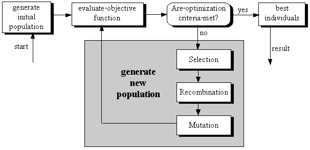

name: inverse
layout: true
class: center, middle, inverse

---

## Metaheuristics

.right-column[.footnote[Data Science Seville]]

---

layout: false

# Roadmap

* Introduction

* Single solution based metaheuristics

	- Simulated annealing
	- Tabu search
	
* Population based metaheuristics
	
	- Genetic algorithm
	- Particle swarm optimization

* Metaheuristics for multiobjective optimization

	- Pareto domination and Pareto frontier
	
---
class: center, middle

# Introduction

---

# Introduction

.left[When we talk about metaheuristics, we refer to a set of algorithms that give us **good and generic solutions for many optimization problems**.]

.left[The fact that we find a solution for an optimization problem using metaheuristics **doesn't mean that we obtain the optimal solution for that problem**. That's the reason for what we need metaheuristics.]

.left[If we relate metaheuristics with heuristics, the metaheuristics are in an **upper level from the heuristics**, so they are like strategies that we can use to design and improve heuristics.]

---

# Introduction

.left[When we work with metaheuristics, we have a lot of subproblems (or subsolutions) to take into account to solve and to model problems.]

.left[The main concepts that all the metaheuristics have in common are: the **representation**, the **objective function** and the **constraint handling**.]

.center[]

---

# Introduction

.left[In this presentation we are not going to talk about all the related stuff with metaheuristics. There are many (and better) presentations and texts where we can deep into this concept.]

.left[The main point of this presentation is to present a group of metaheuristics algorithms like solutions for a set of problems, taking into account the most relevant details in each one.]

.left[The next points are as follows: *single solution based metaheuristics* (simulated annealing and Tabu search), *population based metaheuristics* (genetic algorithms and PSO) and metaheuristics for *multiobjective optimization* (Pareto domination and Pareto frontier).]

.left[We will focus on main points or concepts inside each part of the presentation. Run you fools if you wait an exhaustive presentation!]

---

class: center, middle

# Single solution based metaheuristics

---

# Single solution based metaheuristics

.left[When we talk about single solution based metaheuristics, we are talking about **improve a single solution**. That is, when we face an optimization problem, **iteratively apply the generation and replacement procedures from the current single solution**.]

.left[So, like we have said above, we have two main phases: **generation** and **replacement**. In the generation phase, a set of candidates solutions are generated from the current solution S. The current solution set S is generally obtained by local transformations of the solution. In the replacement phase, a selection is performed from the candidate solution set to replace the current solution.]

.center[]

---

# Single solution based metaheuristics

.left[Like we saw at the beginning of the presentation, the different metaheuristics solutions have in common some concepts. When we talk about single solution based metaheuristics, we could talk again about shared concepts:]

* *Initial solution*: random or by a given heuristic (greedy algorithm)
* *Neighborhood*: this is the main concept of S-metaheuristics. Our main task is to find the perfect relationship between the efficiency of the representation and its effectiveness.
* *Incremental evaluation of the neighborhood*: what decision we take to keep evaluating the neighborhood.
* *sStopping criteria*: when and how stop to evaluate the neighborhood.

.left[After this fast view about S-metaheuristics, we are going to focus in only two examples of S-metaheuristics: **simulated annealing** and **tabu search**.]

---

# Single solution based metaheuristics - Simulated annealing

.left[The name and inspiration of this algorithm come from annealing in metalurgy. a technique involving heating and controlled cooling of a material to increase the size of its crystals and reduce their defects. Both are attributes of the material that depend on its thermodynamic free energy. Heating and cooling the material affects both the temperature and the thermodynamic free energy. While the same amount of cooling brings the same amount of decrease in temperature it will bring a bigger or smaller decrease in the thermodynamic free energy depending on the rate that it occurs, with a slower rate producing a bigger decrease.]

.left[This notion of slow cooling is implemented in the Simulated Annealing algorithm as **a slow decrease in the probability of accepting worse solutions as it explores the solution space**. Accepting worse solutions is a fundamental property of metaheuristics because **it allows for a more extensive search for the optimal solution**.]

.center[]

---

# Single solution based metaheuristics - Simulated annealing

.left[Once we have an introduction about the algorithm we will focus on the most critical parts of study, in fact, the parameters.]

.left[The problem that we have use to get an optimal solution with simulated annealing has been a TSP problem about the main cities in Spain. So applying the algorithm, we get a minimal tour that pass for each city. Like you can imagine, the good the solution is depends on the parameters that we choose and in the resources of the machine.]

.left[This is the list of cities with their coordinates:]

'Madrid': (40.41669, -3.700346),
'Barcelona': (41.38792, 2.169919),
'Valencia': (39.47024, -0.3768049),
'Sevilla': (37.38264, -5.996295),
'Zaragoza': (41.65629, -0.8765379),
'Malaga': (36.71965, -4.420019),
'Murcia': (37.98344, -1.12989),
'Palma': (39.56951, 2.649966),
'Palmas de Gran Canaria (Las)': (28.12482, -15.43001),
'Bilbao': (43.25696, -2.923441),
'Alicante': (38.3452, -0.481006),
'Cordoba': (37.88473, -4.779152),
'Valladolid': (41.65295, -4.728388),
'Vigo': (42.23136, -8.712447),
'Gijon': (43.54526, -5.661926),
'Hospitalet de Llobregat': (41.35958, 2.099704),
'Coruna (A)': (43.37087, -8.395835),
'Vitoria-Gasteiz': (42.84641, -2.667893),
'Granada': (37.17649, -3.597929)

.left[Right now, we are going to see an example of the execution with differente parameters, choosen by trial and error. In the future, we come back to introduce another interesting option to choose the parameters.]

---

# Single solution based metaheuristics - Simulated annealing

.left[GIFS DE LAS DISTINTAS SOLUCIONES O SÓLO IMÁGENES?]

---

class: center, middle

# Single solution based metaheuristics - Tabu search

---

# Single solution based metaheuristics - Tabu search

.left[Tabu search is a powerful metaheuristic method that exploits the basic rule of local search metaheuristics. Remember that this kind of metaheuristics look for an improved **solution inside the neighborhood of potential solutions**.]

.left[The difference that tabu search adds to the party is that **at each step worse moves can be accepted if no improving move is available**. Stop and think about it. Tabu search breaks the definition of the S-metaheuristics, but it does for a good reason: with this rule, **we can avoid the problem when we find a local optimum**.]

.left[And in addition, we maintain a list of previous solutions to prevent the algorithm to come back to solutions that don't are the optimal. You can imagine that this list of previous solutions takes the name of tabu list.]

.center[]

---

# Single solution based metaheuristics - Tabu search

.left[The problem that we have chosen to get an optimal solution using tabu search is the TSP with the Waldo positions, created by Randall Olson [1]. In this problem, we have the positions of Waldo and the problem is basically an abstraction of a TSP problem.]

.left[We have developed some solutions changing the parameters of the algorithm, basically the number of iterations and the length of the tabu list. In the next slide we can compare three of this executions.]

.center[]
.center[]

[1] http://www.randalolson.com/2015/02/03/heres-waldo-computing-the-optimal-search-strategy-for-finding-waldo/
---

# Single solution based metaheuristics - Tabu search

.center[]

---

class: center, middle

# Population based metaheuristics

---

# Population based metaheuristics

.left[Population-based metaheuristics (P-metaheuristics) share many common concepts. They could be viewed as an iterative improvement in a population of solutions. First, the population is initialized. Then, a new population of solutions is generated. Finally, this newpopulation is integrated into the current one using some selection procedures. The search process is stopped when a given condition is satisfied (stopping criterion).]

.center[]

.left[Algorithms such as evolutionary algorithms (EAs), scatter search (SS), estimation of distribution algorithms (EDAs), particle swarm optimization (PSO), bee colony (BC), and artificial immune systems (AISs) belong to this class of metaheuristics. We have developed our examples with evolutionary algorithms, concretely genetic algorithms, and PSO.]

---

# Population based metaheuristics

.left[Let's explain a little bit the main concepts around this kind of metaheuristics:]

* Initial population: an initial population may be specified randomly (pseudo-random, quasi-random) or by a given procedure (sequential diversification, parallel diversification, heuristic).
* Stopping criteria: In addition to the traditional stopping criteria of S-metaheuristics, the stopping criteria in P-metaheuristics may be based on some statistics of the current population (population diversity) or the evolution of a population.

.left[In addition, we can define two big sets of types of solutions inside P-metaheuristics:]

* Evolution based: In evolutionary P-metaheuristics such as evolutionary algorithms, differential evolution, scatter search, bee colony (marriage process of bees), and artificial immune systems (clonal selection), the selection and variation operators (e.g., recombination) constitute the main search components.

* Blackboard based: In blackboard-based P-metaheuristics such as ant colonies, estimation of distribution algorithms, particle swarm optimization, and bee food foraging, the construction of the shared memory (e.g., probabilistic model, pheromone trails, global best, waggle dance) and the generation of operator that create a solution according to the global shared memory are the main search components.

---

# Population based metaheuristics - Genetic algorithm

.left[In the field of artificial intelligence, a genetic algorithm (GA) is a search heuristic that mimics the process of natural selection. This heuristic (also sometimes called a metaheuristic) is routinely used to generate useful solutions to optimization and search problems.[1] Genetic algorithms belong to the larger class of evolutionary algorithms (EA), which generate solutions to optimization problems using techniques inspired by natural evolution, such as inheritance, mutation, selection, and crossover.]

.left[Like we saw with the tabu search algorithm, for the algorithms selected in this part of the presentation we have chosen the TSP Waldo problem by Randal Olson. This selection is to compare the results between the two algorithms too.]

---

# Population based metaheuristics - Genetic algorithm

.left[In the case of genetic algorithms, the most important part is the selected crossover method. When solving TSP problems with genetic algorithm we need to take into account that one restriction of the problem is to pass over all the cities. So, we need to be careful to do not repeat and do not remove any city when we apply the crossover method. For that reason we have chosen the ordered crossover.]

.center[]

.left[In the next slide we will see how our algorithm look for some solutions with different parameters selected by trial and error again.]

---

# Population based metaheuristics - Genetic algorithm

.center[]

---

# Population based metaheuristics - Genetic algorithm vs tabu search

.center[]
.center[]

---

# Population based metaheuristics - PSO

.left[In computer science, particle swarm optimization (PSO) is a computational method that optimizes a problem by iteratively trying to improve a candidate solution with regard to a given measure of quality. PSO optimizes a problem by having a population of candidate solutions, here dubbed particles, and moving these particles around in the search-space according to simple mathematical formulae over the particle's position and velocity. Each particle's movement is influenced by its local best known position but, is also guided toward the best known positions in the search-space, which are updated as better positions are found by other particles. This is expected to move the swarm toward the best solutions.]

.center[]

.left[Our first idea was to solve the same TSP problem presented in the previous slides with a PSO metaheuristic. We found ourselves inside a new problem, adapt the TSP problem (a discrete problem) to solve it with a PSO algorithm (more indicated to solve continuous problems).]

---

# Population based metaheuristics - PSO

.left[After read some papers (PONER ENLACE A PAPERS) and discuss it, the experiment was not right. Maybe in the future with more time we will try it again :P.]

.left[But this problem opened a door to another use for the PSO, what about use the PSO algorithm like a previous step to choose the parameters of a simulated annealing problem? And that is, we use the PSO to have an entry point for the simulated annealing algorithm instead of use trial and error to select them.]

.left[In the next slide you can see some examples of our results.]

---

# Population based metaheuristics - PSO

.left[GIFS DE LAS DISTINTAS SOLUCIONES O SÓLO IMÁGENES?]

---

class: center, middle

# Multiobjective algorithms

---

# Multiobjective algorithms

.left[Many industrial domains are concerned about large and complex optimization problems involving many criteria. Indeed, optimization problems encountered in practice are seldom monoobjective. In general, there are many conflicting objectives to handle. For instance, in designing a given product, one must have to minimize its cost, maximize its quality (e.g., in terms of physic, mechanic, or service), and minimize its environmental impact. In fact, many diverse areas (e.g., engineering design, bioinformatics, logistics, transportation, telecommunication, environment, aeronautics, finance) are concerned about multiobjective optimization problems (MOPs)2.]

.left[The optimal solution for MOPs is not a single solution as for monoobjective optimization problems, but a set of solutions defined as Pareto optimal solutions. A solution is Pareto optimal if it is not possible to improve a given objective without deteriorating at least another objective. This set of solutions represents the compromise solutions between the different conflicting objectives. The main goal of the resolution of a multiobjective problem is to obtain the Pareto optimal set and, consequently, the Pareto front. Notwithstanding this, when metaheuristics are applied, the goal becomes to obtain an approximation of the Pareto optimal set having two properties: convergence to the Pareto optimal front and uniform diversity. The first property ensures the generation of near-optimal Pareto solutions, while the second property indicates a good distribution of the obtained solutions around the Pareto optimal front, so that no valuable information is lost.]

---

# Multiobjective algorithms

.left[Compared to monoobjective optimization, the difficulty in solving MOPs lies in the following general facts:]

* There are no commonly used definitions on the global optimality of a solution as in monoobjective optimization. The order relation between solutions of a MOP problem is partial, and the final choice depends on the decision maker.

* The number of Pareto optimal solutions increases according to the size of the problem and mainly with the number of objectives being considered. Indeed, at least all Pareto solutions of an n-objective problem are necessary Pareto solutions of the same problem with an additional objective function. For instance, the number of Pareto optimal solutions may be exponential with respect to the problem size (e.g., some NP-hard combinatorial multiobjective optimization problems)

* The structure of the Pareto front (e.g., continuity, convexity, multimodality) depends on the studied MOP. For instance, the Pareto optimal solutions may be localized on the frontier and inside the convex hull of feasible solutions. Moreover, most of the MOPs are NP-hard problems.

---

# Multiobjective algorithms - Pareto domination and pareto frontier

.left[Actually when we look for some implementations for multiobjective algorithms, the options are near none. For that reason, we have implement our own multiobjective algorithm. Is the more simple solution but represent correctly the idea that we want to transmit.]

.left[Our problem is to build an optimal cone. For that purpose we will have two inputs variables (radio and height), two objectives function (minimize the lateral surface area and minimize the total area) and we have one constraint because our volume will be greater than 200 cm^3.] 

.center[]

---

# Multiobjective algorithms - Pareto domination and pareto frontier

.left[So, we will have the next variables to design our problem:]

* r = base radius  - Input variable number 1, value between 0,10
* h = height  - Input variable number 2, value between 0,20
* s = slant height
* V = volume  - One constraint, V > 200
* B = base area
* S = lateral surface area  - One objective, minimize S
* T = total area  - One objective, minimize T

.left[And these formulas:]

* s = sqrt(r^2 + h^2)
* V = pi/3 * r^r * h
* B = pi * r^2
* S = pi * r * s
* T = B + S = pi * r * (r + s)

.left[Once defined the problem, we have implement both the pareto domination and the pareto frontier to see how the solutions are represented. In the next slide you can see the results.]

---

# Multiobjective algorithms - Pareto domination and pareto frontier

.center[]
.center[]
.center[]

---

# Bibliography

Metaheuristics : from design to implementation; Talbi, El-Ghazali

http://en.wikipedia.org/wiki/Simulated_annealing
http://www.randalolson.com/2015/02/03/heres-waldo-computing-the-optimal-search-strategy-for-finding-waldo/
http://en.wikipedia.org/wiki/Tabu_search
http://en.wikipedia.org/wiki/Genetic_algorithm
http://en.wikipedia.org/wiki/Particle_swarm_optimization
http://www.math.unipd.it/~marcuzzi/DIDATTICA/LEZ&ESE_PIAI_Matematica/3_cones.pdf

Repository of code: https://github.com/gabmunrio/metaheuristics-methods

---